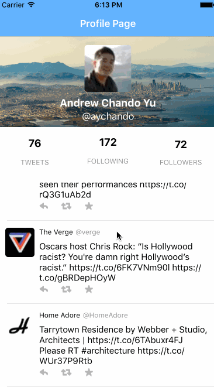

# Project 4 - *Twitter Redux*

Time spent: **12** hours spent in total

## User Stories

The following **required** functionality is completed:

- [x] Hamburger menu
    - [x] Dragging anywhere in the view should reveal the menu.
    - [x] The menu should include links to your profile, the home timeline, and the mentions view.
    - [x] The menu can look similar to the example or feel free to take liberty with the UI.
- [x] Profile page
    - [x] Contains the user header view
    - [x] Contains a section with the users basic stats: # tweets, # following, # followers
- [x] Home Timeline
    - [x] Tapping on a user image should bring up that user's profile page

The following **optional** features are implemented:

- Profile Page
    - [ ] Implement the paging view for the user description.
    - [ ] As the paging view moves, increase the opacity of the background screen. See the actual Twitter app for this effect
    - [ ] Pulling down the profile page should blur and resize the header image.
- Account switching
    - [ ] Long press on tab bar to bring up Account view with animation
    - [ ] Tap account to switch to
    - [ ] Include a plus button to Add an Account
    - [ ] Swipe to delete an account

Please list two areas of the assignment you'd like to **discuss further with your peers** during the next class (examples include better ways to implement something, how to extend your app in certain ways, etc):

1. Still had some minor issues getting container views / child views to show exactly how I wanted, would like to discuss best practices
2. Would like to delve into nibs and feaatures of the storyboard that helps deal with modular, repeated parts (e.g. Tweet cell)

## Video Walkthrough

Here's a walkthrough of implemented user stories:

GIF created with [LiceCap](http://www.cockos.com/licecap/).

